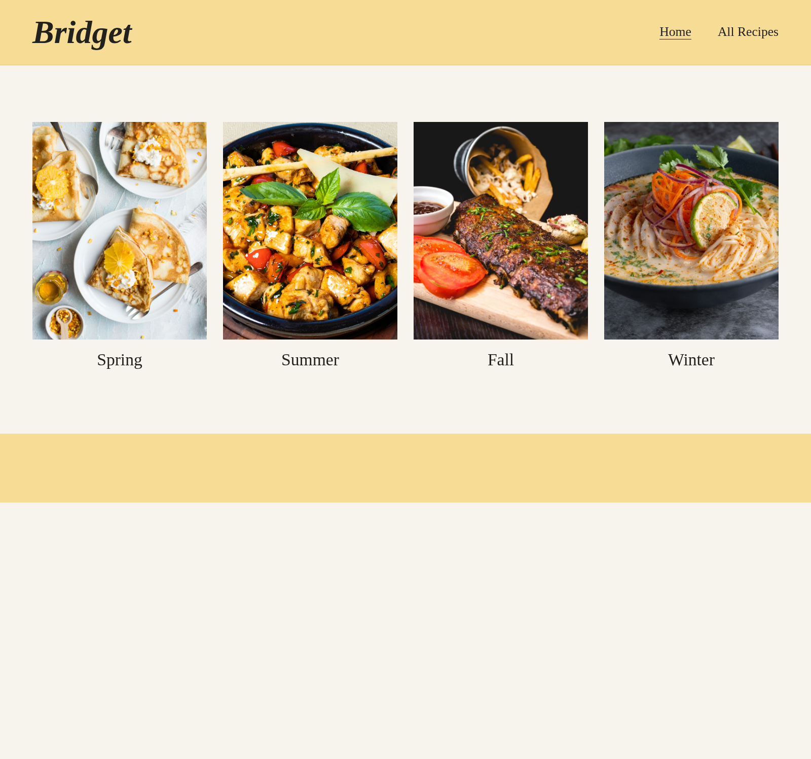
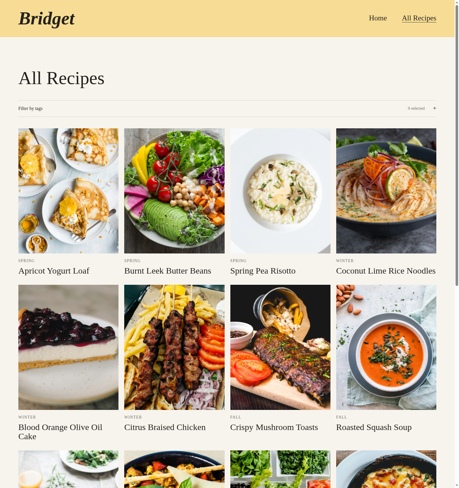
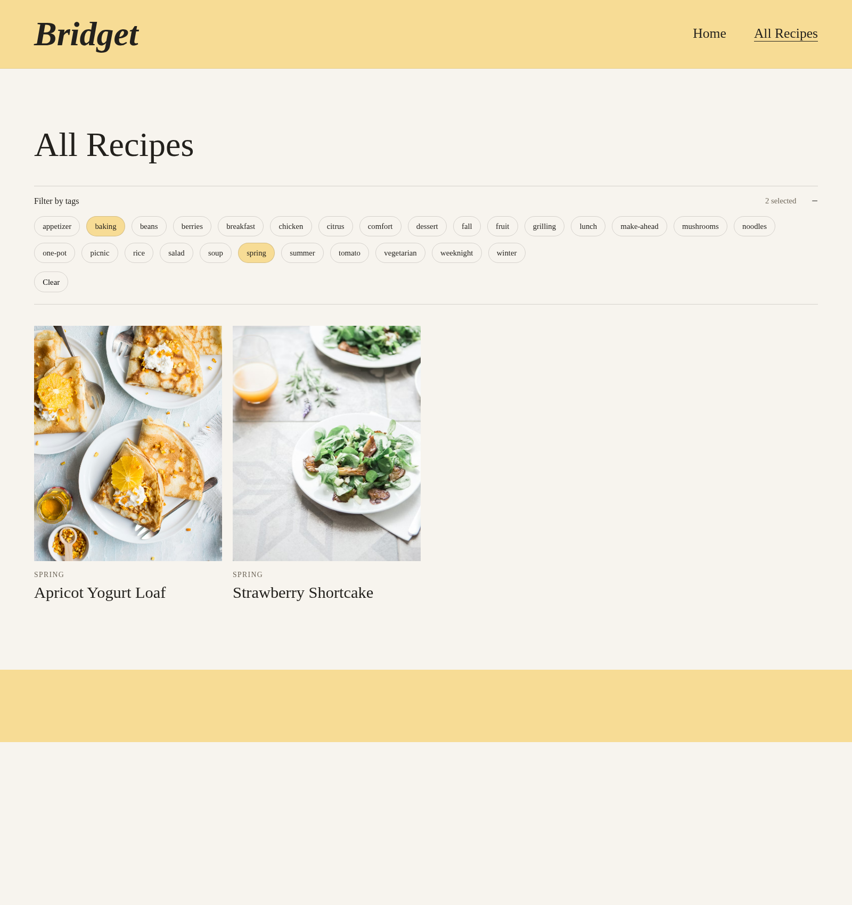
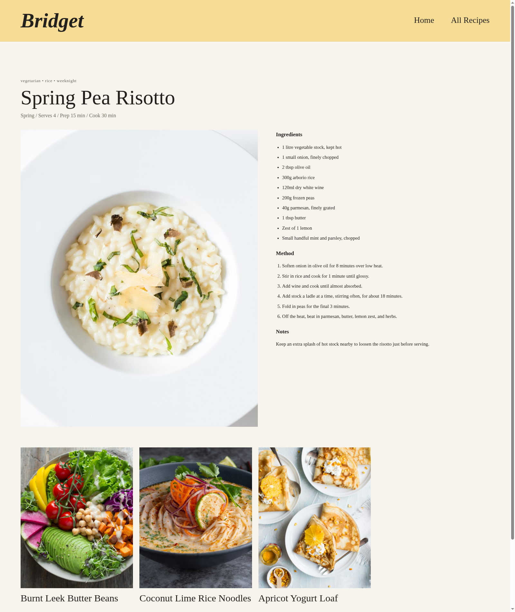

# Recipe Site Quiet Restyle QA

*2026-04-21T03:29:38Z by Showboat 0.6.1*
<!-- showboat-id: 8d88e4f3-5830-4212-b3db-40b6a7d46512 -->

Returned the site to a simpler, more literal structure: yellow header and footer bands, seasonal homepage grid, four-across recipe listing, restrained recipe detail layout, and a collapsible tag filter with URL-backed multi-select.

```bash
cd /workspace && ASTRO_TELEMETRY_DISABLED=1 npm run build
```

```output

> build
> astro build

03:29:39 [content] Syncing content
03:29:39 [content] Synced content
03:29:39 [types] Generated 44ms
03:29:39 [build] output: "static"
03:29:39 [build] mode: "static"
03:29:39 [build] directory: /workspace/dist/
03:29:39 [build] Collecting build info...
03:29:39 [build] ✓ Completed in 62ms.
03:29:39 [build] Building static entrypoints...
03:29:40 [vite] ✓ built in 1.10s
03:29:40 [build] ✓ Completed in 1.15s.

 generating static routes 
03:29:40 ▶ src/pages/all-recipes.astro
03:29:40   └─ /all-recipes/index.html (+12ms) 
03:29:40 ▶ src/pages/recipes/apricot-yogurt-loaf.md
03:29:40   └─ /recipes/apricot-yogurt-loaf/index.html (+3ms) 
03:29:40 ▶ src/pages/recipes/blood-orange-cake.md
03:29:40   └─ /recipes/blood-orange-cake/index.html (+2ms) 
03:29:40 ▶ src/pages/recipes/burnt-leek-butter-beans.md
03:29:40   └─ /recipes/burnt-leek-butter-beans/index.html (+3ms) 
03:29:40 ▶ src/pages/recipes/charred-corn-salad.md
03:29:40   └─ /recipes/charred-corn-salad/index.html (+3ms) 
03:29:40 ▶ src/pages/recipes/citrus-braised-chicken.md
03:29:40   └─ /recipes/citrus-braised-chicken/index.html (+2ms) 
03:29:40 ▶ src/pages/recipes/coconut-lime-rice-noodles.md
03:29:40   └─ /recipes/coconut-lime-rice-noodles/index.html (+1ms) 
03:29:40 ▶ src/pages/recipes/mushroom-toasts.md
03:29:40   └─ /recipes/mushroom-toasts/index.html (+1ms) 
03:29:40 ▶ src/pages/recipes/roasted-plum-ripple.md
03:29:40   └─ /recipes/roasted-plum-ripple/index.html (+3ms) 
03:29:40 ▶ src/pages/recipes/soft-herb-frittata.md
03:29:40   └─ /recipes/soft-herb-frittata/index.html (+2ms) 
03:29:40 ▶ src/pages/recipes/spring-pea-risotto.md
03:29:40   └─ /recipes/spring-pea-risotto/index.html (+2ms) 
03:29:40 ▶ src/pages/recipes/squash-soup.md
03:29:40   └─ /recipes/squash-soup/index.html (+1ms) 
03:29:40 ▶ src/pages/recipes/strawberry-shortcake.md
03:29:40   └─ /recipes/strawberry-shortcake/index.html (+1ms) 
03:29:40 ▶ src/pages/recipes/tomato-galette.md
03:29:40   └─ /recipes/tomato-galette/index.html (+1ms) 
03:29:40 ▶ src/pages/tags/[tag].astro
03:29:40   ├─ /tags/appetizer/index.html (+2ms) 
03:29:40   ├─ /tags/baking/index.html (+3ms) 
03:29:40   ├─ /tags/beans/index.html (+1ms) 
03:29:40   ├─ /tags/berries/index.html (+1ms) 
03:29:40   ├─ /tags/breakfast/index.html (+1ms) 
03:29:40   ├─ /tags/chicken/index.html (+1ms) 
03:29:40   ├─ /tags/citrus/index.html (+1ms) 
03:29:40   ├─ /tags/comfort/index.html (+2ms) 
03:29:40   ├─ /tags/dessert/index.html (+2ms) 
03:29:40   ├─ /tags/fall/index.html (+1ms) 
03:29:40   ├─ /tags/fruit/index.html (+1ms) 
03:29:40   ├─ /tags/grilling/index.html (+1ms) 
03:29:40   ├─ /tags/lunch/index.html (+1ms) 
03:29:40   ├─ /tags/make-ahead/index.html (+1ms) 
03:29:40   ├─ /tags/mushrooms/index.html (+1ms) 
03:29:40   ├─ /tags/noodles/index.html (+1ms) 
03:29:40   ├─ /tags/one-pot/index.html (+2ms) 
03:29:40   ├─ /tags/picnic/index.html (+1ms) 
03:29:40   ├─ /tags/rice/index.html (+1ms) 
03:29:40   ├─ /tags/salad/index.html (+1ms) 
03:29:40   ├─ /tags/soup/index.html (+1ms) 
03:29:40   ├─ /tags/spring/index.html (+1ms) 
03:29:40   ├─ /tags/summer/index.html (+1ms) 
03:29:40   ├─ /tags/tomato/index.html (+1ms) 
03:29:40   ├─ /tags/vegetarian/index.html (+1ms) 
03:29:40   ├─ /tags/weeknight/index.html (+1ms) 
03:29:40   └─ /tags/winter/index.html (+1ms) 
03:29:40 ▶ src/pages/index.astro
03:29:40   └─ /index.html (+1ms) 
03:29:40 ✓ Completed in 90ms.

03:29:40 [build] 42 page(s) built in 1.32s
03:29:40 [build] Complete!
```

Screenshots captured with Rodney against the local Astro preview server:

```bash {image}

```



```bash {image}

```



```bash {image}

```



```bash {image}

```


